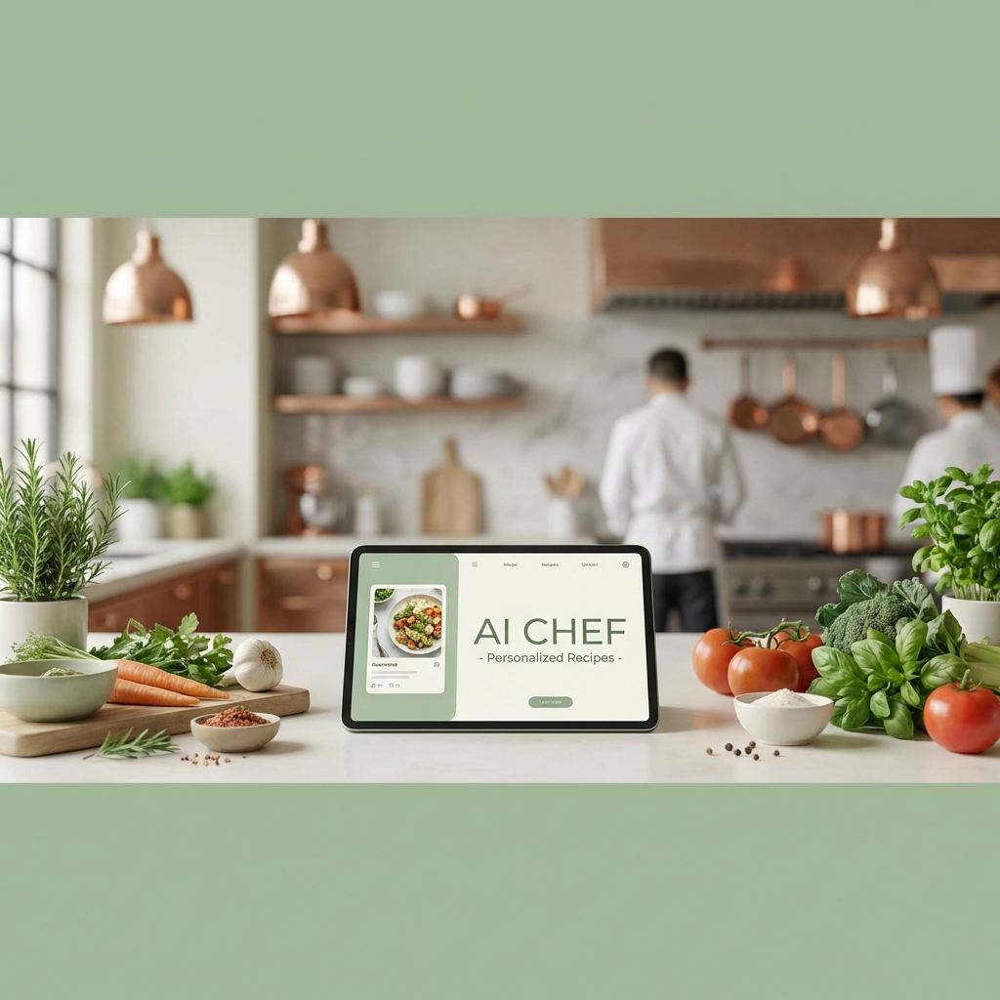

# 🧑‍🍳 My Own Chef AI



## ✨ Overview
**My Own Chef AI** is a hyper-personalized culinary assistant designed to bridge the gap between complex dietary requirements and gourmet home cooking. Built specifically to handle food intolerances identified via clinical testing (like the YorkTest), it ensures every meal is safe, delicious, and perfectly tailored to your body.

## 🛡️ The Intolerance Guard
This application is more than just a recipe book. It features an active **Intolerance Guard** that silences dangerous ingredients before they ever reach your plate. 

**Currently optimized for Joanne's Profile:**
- 🚫 **Strict Avoidance**: Yeast, Cow's Milk, Goat's Milk, Egg Whites, and Cranberries.
- ⚠️ **Smart Monitoring**: Wheat, Gluten, Curry Powder, and Nutmeg.

## 🚀 Key Features
- **Intelligent Filtering**: AI-driven recipe generation that automatically substitutes or removes allergens.
- **Zen Kitchen UI**: A serene, premium interface designed for a focused and enjoyable cooking experience.
- **Smart Ingredient Sourcing**: One-click shopping links for every ingredient, searching the web for the best local or online stores.
- **Nutrition Logic**: Prioritizes nutrient density and Vitamin D pairing with non-dairy calcium sources.

## 🛠️ Tech Stack
- **Frontend**: React.js with Vite
- **Styling**: Vanilla CSS (Custom Zen Design System)
- **Typography**: Playfair Display (Serif) & Quicksand (Sans-serif)
- **AI Brain**: Tailored prompting logic for allergy-safe culinary architecture.

## 📦 Getting Started

### Prerequisites
- Node.js (v18 or higher)
- npm or yarn

### Installation
1. Clone the repository:
   ```bash
   git clone https://github.com/Tom19840813/My-own-Chef.git
   ```
2. Navigate to the project directory:
   ```bash
   cd My-own-Chef
   ```
3. Install dependencies:
   ```bash
   npm install
   ```
4. Start the development server:
   ```bash
   npm run dev
   ```

## 🎨 Design Philosophy
The "Zen Kitchen" aesthetic uses a palette of **Sage Green**, **Bone White**, and **Gold Accents** to create a calm environment, reducing the stress often associated with managing food intolerances.

---

*Designed & Developed by Antigravity AI Assistant*
